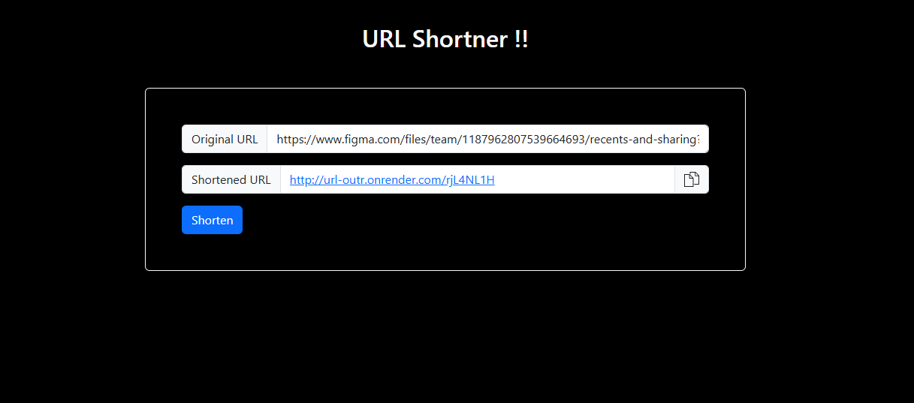

## 🔗 URL Shortener

A simple and efficient URL Shortener web application that converts long URLs into short, shareable links.

## Live Demo
[URL Shortener](https://url-outr.onrender.com/)



## Features

-  Shorten long URLs instantly
-  Fast redirection to original URLs
-  Clean and minimal UI
-  Persistent storage
-  Deployed on Render

## 🛠️ Tech Stack

### Frontend
- HTML
- CSS (Bootstrap)
- JavaScript

### Backend
- Node.js
- Express.js

### Deployment
- Render

## 📂 Project Structure

```text
URL-shortener/
│── public/ # Frontend files
│── routes/ # API routes
│── models/ # Database model
│── server.js # Entry point
│── package.json
```

## ⚙️ Installation & Setup

###  Clone the repository
```bash
git clone https://github.com/Varun04-pixel/URL-shortener.git
cd URL-shortener
```
###  Install dependencies
```bash
npm install
```
###  Run the server
```bash
npm start
```
###  Server will run on:
```bash
http://localhost:3000
```
###  Create a .env file in the root directory:
```bash
PORT=3000
DB_pass = your_mongoDB_pass_key
```
